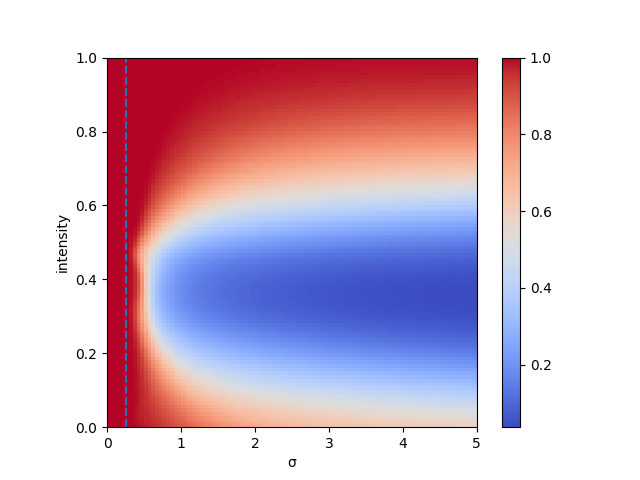
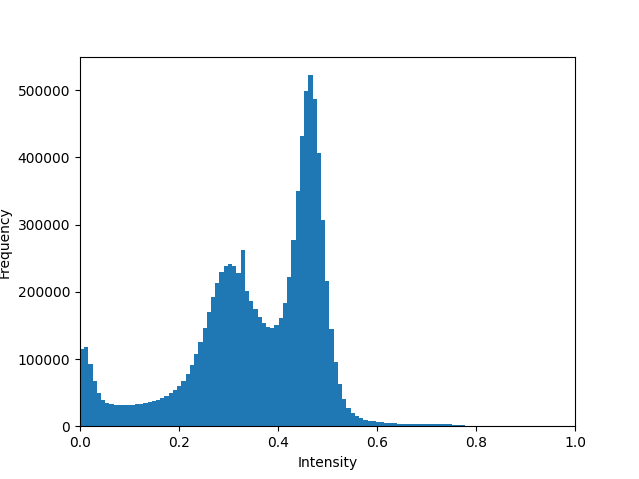
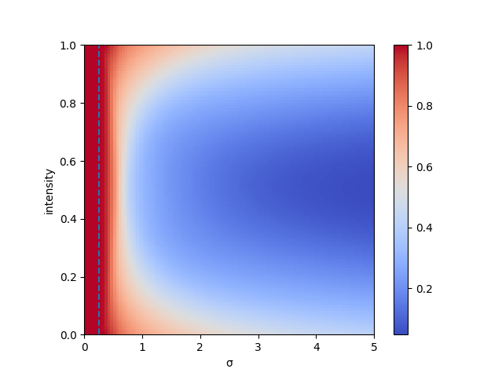
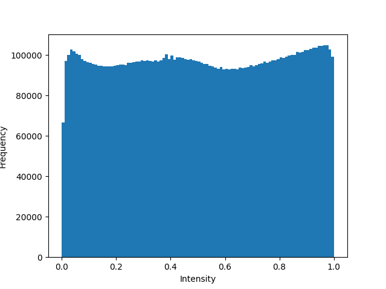

# Official Repository of: "On the Pitfalls of Using the Residual Error as Anomaly Score"

This repository contains the code to reproduce the experiments from the paper.

Abstract: *Many current state-of-the-art methods for anomaly detection in medical images rely on calculating a residual image between a potentially anomalous input image and its ("healthy") reconstruction. As the reconstruction of the unseen anomalous region should be erroneous, this yields large residuals as a score to detect anomalies in medical images. However, this assumption does not take into account residuals resulting from imperfect reconstructions of the machine learning models used. Such errors can easily overshadow residuals of interest and therefore strongly question the use of residual images as scoring function. Our work explores this fundamental problem of residual images in detail. We theoretically define the problem and thoroughly evaluate the influence of intensity and texture of anomalies against the effect of imperfect reconstructions in a series of experiments.*

## 1. Download and Prepare Data

Download the data from [https://www.synapse.org/#!Synapse:syn21343101/files/](https://www.synapse.org/#!Synapse:syn21343101/files/) and split it into a training and a test set using

```
python dataset.py
```

## 2. Run the Experiments

For experiment 3, you will need to train some machine learning models.
Experiment tracking and checkpointing is done with Weights & Biases ([https://wandb.ai](https://wandb.ai)), you can create a free account there and change the account information in `train_autoencoder.py`, `train_vqvae.py`, `models.py`, and `vqvae.py`.

## 3. Results

 The results of our experiment indicate that there are major flaws with using the pixel-wise residual as an anomaly score in medical grayscale images. Detection performance drops significantly if the intensities of anomal pixels are in regions well covered by normal pixels.

Before histogram equalization:

<p float="left">
  
   
</p>

After histogram equalization:

<p float="left">
  
   
</p>

This Figures above show reduced anomaly segmentation performance (measured in average precision) when the intensity of the anomaly is in an area well covered by normal pixel intensities.
